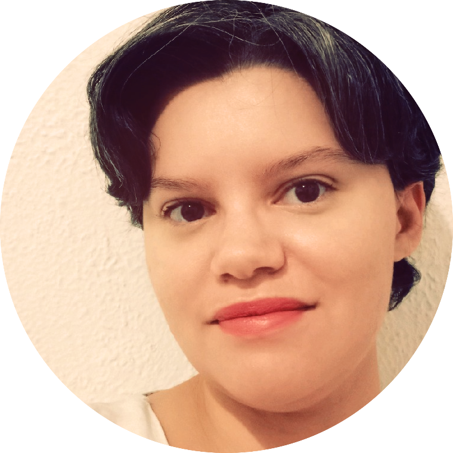

# Olá! Eu sou a Ana Carolina Gomes, engenheira de software e linguista

---
## **Quem sou eu**

Sou mestre em Linguística pela FFLCH/USP, tecnóloga em Análise e Desenvolvimento de Sistemas pela FATEC São Caetano do Sul e Knowledge Managent Analyst na Kognita Lab.

Também atuo como voluntária na comunidade Start Coding, que visa promover conhecimentos para mulheres em tecnologia e despertar a curiosidade em pessoas interessadas pela área de tecnologia.

********************

## **Minha trajetória profissional**

Cursei o Bacahrelado em Letras - Português e Espanhol pela FFLCH/USP, finalizado em 2014.

Realizei mestrado na área de neurolinguística e pragmática pela FFLCH/USP. Defendi o mestrado em 2018.

No mesmo ano de defesa do mestrado, resolvi fazer uma transição de carreira para a área de tecnologia da informação.

Em 2019 iniciei o curso de Tecnologia em Análise e Desenvolvimento de Sistemas pela FATEC São Caetano do Sul. Finalizei o curso em julho de 2022.

---

## **Redes Sociais**

 

 

**Dev Landing Page**: [https://lingsv.github.io/](https://lingsv.github.io/)

---
